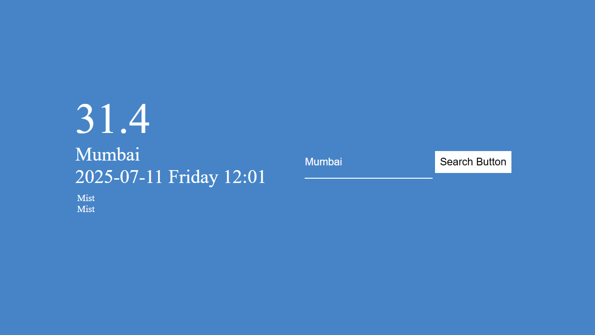

# 🌦️ Weather App

A simple and responsive Weather App built using **HTML**, **CSS**, and **JavaScript** that fetches real-time weather data using the [WeatherAPI](https://www.weatherapi.com/).

## 📌 Features

- 🌍 Search weather by city name
- 🌡️ Displays current temperature in Celsius
- 🕒 Shows local date, time, and day of the searched location
- 🌤️ Shows current weather condition (e.g., Sunny, Mist, Rain)
- 🔄 Automatically fetches weather for a default location (Delhi) on load
- ✅ Clean and minimalistic UI design

## 🧪 Tech Stack

- **HTML5** – Structure
- **CSS3** – Styling
- **JavaScript (ES6+)** – Logic & API integration
- **WeatherAPI** – Real-time weather data

## 🔧 How It Works

1. When the page loads, it automatically fetches the weather data for Delhi.
2. Users can enter a city name in the input field and hit "Search" to get updated weather data.
3. Data is fetched using `fetch()` from the WeatherAPI.
4. The UI is updated dynamically using DOM manipulation.

## 🌐 API Used

- **Endpoint:** `http://api.weatherapi.com/v1/current.json`
- **Parameters:**  
  - `key` – Your WeatherAPI key  
  - `q` – Query (city name)  
  - `aqi` – Air quality index (set to `no`)
- **Example:**  
  `http://api.weatherapi.com/v1/current.json?key=YOUR_API_KEY&q=Delhi&aqi=no`


## 💡 Folder Structure
weather-app/
│
├── index.html # Main HTML file
├── style.css # CSS styles
├── script.js # JavaScript logic & API calls
└── README.md # Project documentation

## 🚀 Getting Started Locally

### Prerequisites

- Web browser (Chrome, Firefox, Edge, etc.)
- Text editor (VS Code recommended)

### Steps

1. **Clone the repository**:
   ```bash
   git clone https://github.com/PriyanshiGoyal501/Weather_App.git
2. **Navigate to the project directory**:
   ```bash
   cd Weather_App
3. **Open the project**:
   - Open `index.html` directly in your browser
   - Or use a Live Server extension in VS Code:
     ```bash
     code .
     ```

    ## 📷 Screenshot

<p align="center">
  
</p>


   ## 👩‍💻 Author

**Priyanshi Goyal**  
[GitHub](https://github.com/PriyanshiGoyal501)
